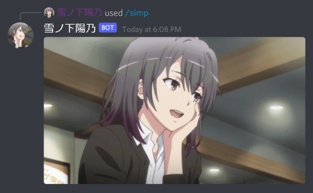

# 雪ノ下陽乃

"陽乃ベストお姉さん" — said CarelessDev/oneesan-lover


## OUR Bot

Haruno is the bot that will serve _our_ server

aka [SIMP Bot](https://github.com/CarelessDev/SIMP-Bot/) 2 because this will replace that

Some function are moved from SIMP Bot

## 💛💛💛



## .env scheme

```
guild_ids: int, ..., int
DISCORD_TOKEN

(Reddit)
client_id
client_secret
username=
password
user_agent

TENOR_APIKEY
```
